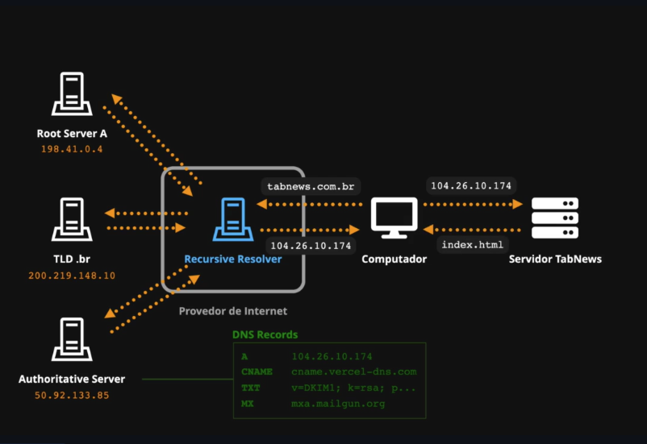
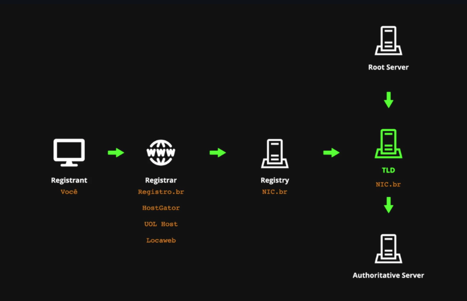

# clone-tabnews

Implementação do https://www.tabnews.com.br para o https://curso.dev
[Link do App na Vercel](https://allanmedeiros71.vercel.app/)

# Notas de Aula

## Ambiente

```
# Install nvm
curl -o- https://raw.githubusercontent.com/nvm-sh/nvm/v0.40.3/install.sh | bash
```

## Dia 3 - (Node.js, Next.js, React e React DOM)

### A fundação

```bash
git clone git@github.com:allanmedeiros71/clone-tabnews.git
node -v
docker -v
docker compose
nvm ls                          # Lista as versões disponíveis do nvm
nvm install lts/hydrogen        # Instala a versão hydrogen do nvm
nvm alias default lts/hydrogen  # Define a versão padrão do nvm
nvm --help
```

### A primeira parede

```bash
npm init
npm install next@13.1.6         # Instala a versão 13.1.6 do next
npm install react@18.2.0        # Instala a versão 18.2.0 do react
npm audit
# react-dom é o pacote que fornece métodos específicos para interagir
# com o DOM (Document Object Model) no navegador, sendo essencial para
# renderizar componentes React na web.
npm install react-dom@18.2.0    # Instala a versão 18.2.0 do react-dom
```

## Dia 5 - Git

```bash
git log             # mostra todos os commits
git log --stat      # mostra todos os commits com estatísticas
git log --oneline   # mostra todos os commits em uma linha
git status          # mostra o status do repositório
git add             # adiciona arquivos para o próximo commit
git commit          # cria um commit
git commit --amend  # altera o último commit
git diff            # mostra as diferenças entre as alterações
```

## Dia 6 - Git

```bash
git commit -m "mensagem"  # atalho para fazer novos commits.
git push                  # empurrar alterações locais para o origin.
git push --force          # empurrar de forma forçada alterações locais para o origin.
git push -f               # a forma comprimida do comando anterior.
git branch                # mostra as branches
```

## Dia 9 - Planejamento

> Fazer `muito com pouco` e não `pouco com muito`... esse é um dos segredos que eu percebi quando o assunto é organização de tarefas.

- Nível 1: Ser lembrado individualmente
  Menor custo de produção (energia para registrar o que precisa ser feito) e menor tempo de aquecimento (quanto tempo demora pra se ver o que precisa ser feito).
- Nível 2: Ser lembrado em grupo
- Nível 3: Expandir conhecimento (Trello ou github)
- Nível 4: Gerar métricas

## Dia 10 - Configurar o Prettier

```bash
npm install --save-dev prettier # Instala o prettier
npm run lint:check              # Verifica se há erros de formatação
npm run lint:fix                # Corrige os erros de formatação
# Para instalar todos os pacotes do package.json (em um outro PC, por exemplo, ou após clonar o repositório)
npm install
```

## Dia 11 - Resolução de DNS



## Dia 12 - Registro de Domínio

### Registrar um domínio próprio

codetabs.com.br


registro.br

whatsmydns.net -> DNS Propagation Checker  
Encaminhar email para contato@curso.dev

### Configurar o Servidor de DNS

#### Vercel

- IP : 216.198.79.1
- DNS :
  - ns1.vercel-dns.com
  - ns2.vercel-dns.com

## Dia 14 - Proposta de Arquitetura e Pastas

```
📦root/
├──📂pages/
│   └──📄index.js
├──📂models/
│   ├──📄users.js
│   ├──📄content.js
│   └──📄password.js
├──📂infra/
│   ├──📄database.js
│   ├──📂migrations/
│   └──📂provisioning/
│       ├──📂staging/
│       └──📂production/
└──📂tests/
```

## Dia 15 - Testes

### Instalar um Test Runner

npm install --save-dev jest@29.6.2

### Criar um Teste

```js
// O teste precisa de 2 parametros: uma descrição e uma função de callback
test("Teste numero 1", funcaoCallback);

function funcaoCallback() {
  console.log("Executando o teste 1");
}

// Outra forma de escrever a função de callback é usando uma função anônima
test("Teste numero 2", function () {
  console.log("Executando o teste 2");
});

// Usando arrow function
test("Teste numero 3", () => {
  console.log("Executando o teste 3");
});

// Exemplo de teste com expectativa
test("Soma de 2 + 2 deve ser igual a 4", () => {
  const resultado = 2 + 2;
  expect(resultado).toBe(4);
});
```

> [!IMPORTANT]
> **Introdução ao JavaScript**\
> [🎥 Curso Grátis de JavaScript e ECMAScript para Iniciantes](https://youtube.com/playlist?list=PLHz_AreHm4dlsK3Nr9GVvXCbpQyHQl1o1)
